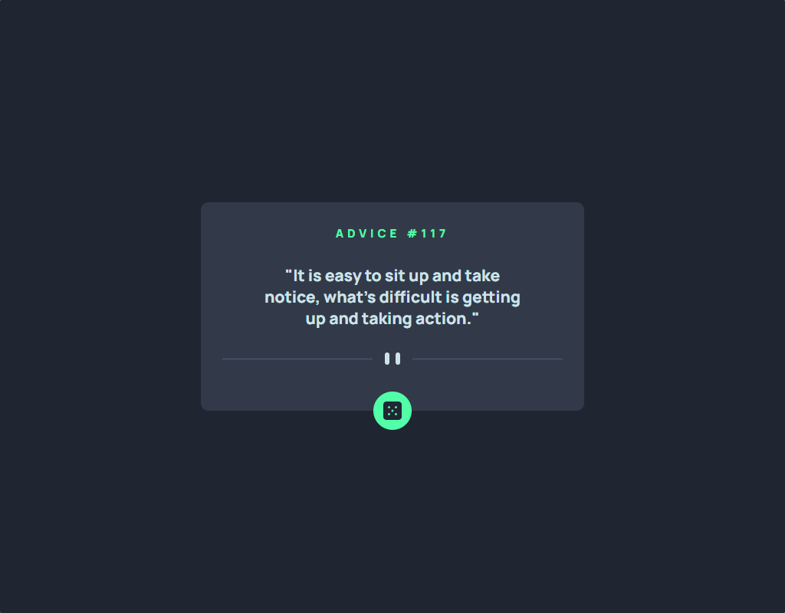
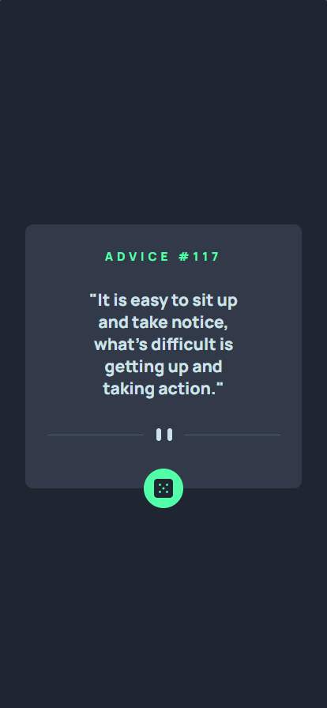

# Exercício 02 - HTML E CSS Avançado Flexbox - App Gerador de Conselhos
Na atividade, tive como objetivo recriar a interface de uma página de um App Gerador de Conselhos usando os conhecimentos de HTML e CSS Avançados do curso DevQuest.

## HTML
Na estrutura HTML, usei a tag main para criar um container, uma tag div para criar o card onde estão contidos os demais elementos da página e o elemento picture para inserir uma divisoria responsiva.

## CSS
Usei três arquivos CSS para estilizar a página: o reset.css para definir o padding e o margin como 0 e o box-sizing como border-box; o variables.css para criar variáveis com as cores usadas na página; e o style.css para estilizar os elementos da página.
Utilizei o flexbox para poder posicionar os elementos da página: centralizar o card na página, definir a direção dos itens em coluna e dar o espaçamento entre os itens.
Para posicionar o botão no local correto, defini o card em posição relativa e o botão em posição absoluta, e então ajustei a posição com a propriedade bottom.
Fiz as responsividade da página usando media queries. Defini uma media querie para uma largura máxima de 425px, dessa forma, quando a resolução da tela for menor ou igual a 425px de largura, o tamanho do card, da fonte e do margin vão ser ajustados para a resolução da tela.

## Resultado
### Desktop

### Mobile
